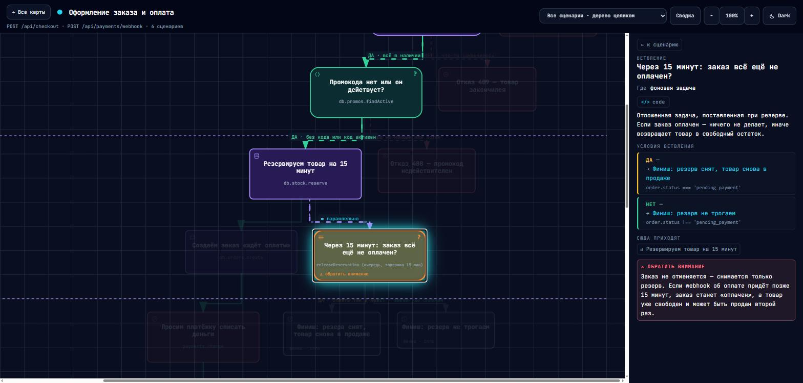
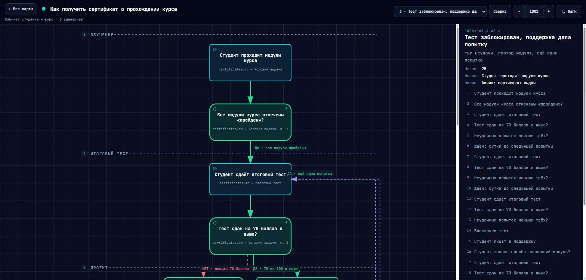
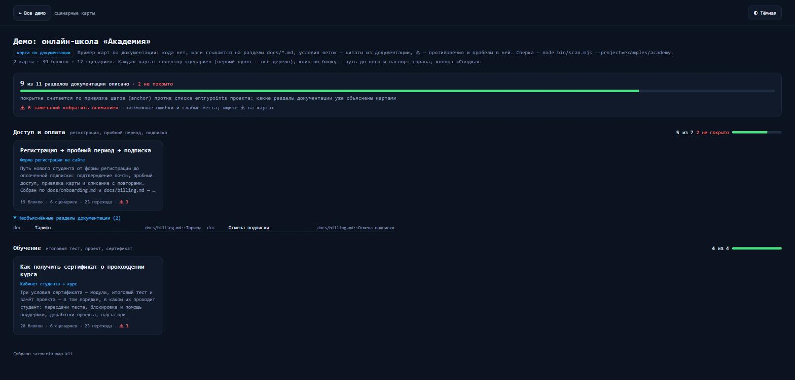

# scenario-map-kit

**Интерактивные карты «вход → финиш с ветвлениями» по коду или документации проекта.**

Карта показывает, что происходит в сценарии, какие бывают исходы и где в коде или документе
принимается каждое решение. Её может построить человек или ИИ-агент, а `scan` предупредит,
если код или документация разошлись с картой.



## Открыть примеры

| Пример | Источник | Открыть |
|---|---|---|
| Интернет-магазин | код `src/*.js` | [главная](https://raw.githack.com/Uspex/ScenarioMap/master/demo/shop/index.html) · [оформление заказа](https://raw.githack.com/Uspex/ScenarioMap/master/demo/shop/checkout.full.html) |
| Онлайн-школа | документация `docs/*.md` | [главная](https://raw.githack.com/Uspex/ScenarioMap/master/demo/academy/index.html) · [сертификат](https://raw.githack.com/Uspex/ScenarioMap/master/demo/academy/certificate.full.html) |
| CRM | регламент без кода | [главная](https://raw.githack.com/Uspex/ScenarioMap/master/demo/crm/index.html) · [заявка → сделка](https://raw.githack.com/Uspex/ScenarioMap/master/demo/crm/lead-to-deal.full.html) |

Все примеры на одной странице — [витрина демо](https://raw.githack.com/Uspex/ScenarioMap/master/index.html).
Локально — открыть `index.html` двойным кликом.

| Сценарий на карте | Главная проекта |
|---|---|
|  |  |

## Быстрый старт

Нужен только Node.js 18+, зависимостей нет.

```bash
node bin/init.mjs ../my-project/docs/scenario-map --title="Мой проект"      # по коду
node bin/init.mjs ../my-project/docs/scenario-map --mode=docs --title="…"   # по документации
node bin/build.mjs --project=../my-project/docs/scenario-map                # собрать карты
```

Или попросите ИИ-агента: «Прочитай `scenario-map-kit/AGENTS.md` и построй сценарные карты этого проекта».

## Документация

[Руководство](docs/GUIDE.md) · [инструкция для агентов](AGENTS.md) · [формат](docs/FORMAT.md) ·
[правила](docs/RULES.md) · [навык Claude Code](skill/SKILL.md)

Лицензия [MIT](LICENSE). Рендерер — [Archify](https://github.com/tt-a1i/archify) (MIT).
